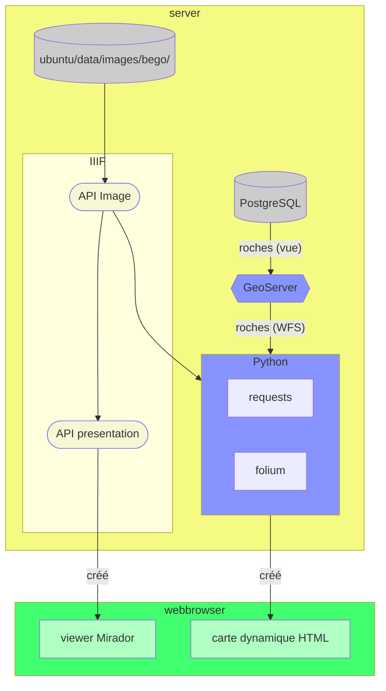
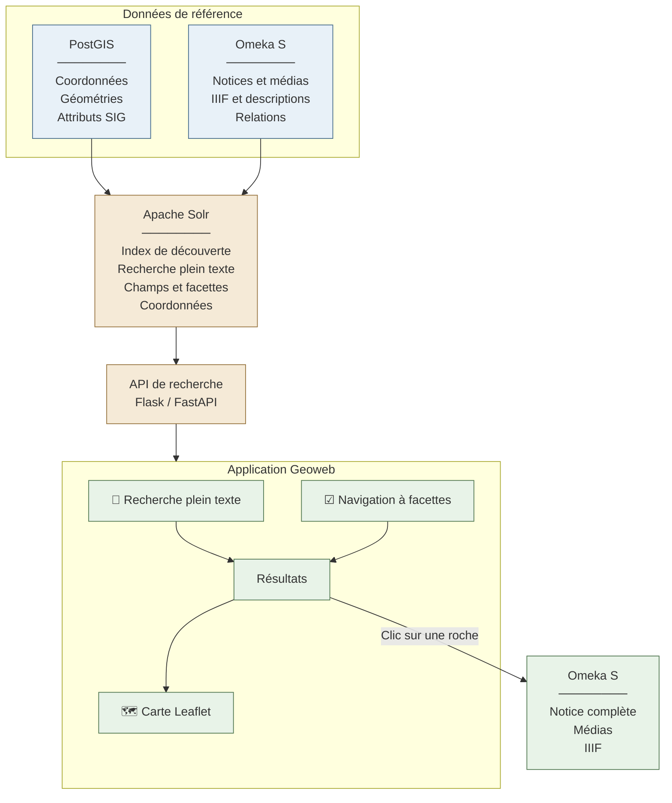

# Bego

## Architecture actuelle

```mermaid
flowchart TD
    subgraph server
        DBimg[(ubuntu/data/images/bego/)] ---> IIIFimg([API Image])
        subgraph IRAMATiiif[IIIF]
            IIIFimg ---> IIIFpres([API presentation])
        end
        IIIFimg ---> Python{{Python}}
        subgraph Python
            requests
            folium
        end
        DB[(PostgreSQL)] -- roches (vue) --> GS{{GeoServer}}
        GS -- roches (WFS) --> Python
    end
  subgraph webbrowser
    IIIFpres -- créé -->  outIIIF[viewer Mirador]
    Python -- créé --> outHTML[carte dynamique HTML]
  end
 

style server fill:#f4fa82
style DBimg fill:#cccccc
style DB fill:#cccccc
style IIIFimg fill:#f6f7d5
style IIIFpres fill:#f6f7d5
style Python fill:#8794ff
style GS fill:#8794ff
style outIIIF fill:#b0ffc3
style outHTML fill:#b0ffc3
style webbrowser fill:#42ff70

```

## Architecture prévue

```mermaid
flowchart TB

    subgraph REF["Données de référence"]
        direction LR

        PG["PostGIS<br/>────────<br/>Coordonnées<br/>Géométries<br/>Attributs SIG"]

        OM["Omeka S<br/>────────<br/>Notices et médias<br/>IIIF et descriptions<br/>Relations"]
    end

    PG --> SOLR
    OM --> SOLR

    SOLR["Apache Solr<br/>────────<br/>Index de découverte<br/>Recherche plein texte<br/>Champs et facettes<br/>Coordonnées"]

    SOLR --> API

    API["API de recherche<br/>Flask / FastAPI"]

    API --> GEO

    subgraph GEO["Application Geoweb"]
        direction TB

        SEARCH["🔎 Recherche plein texte"]
        FACETS["☑ Navigation à facettes"]
        MAP["🗺 Carte Leaflet"]
        RESULTS["Résultats"]

        SEARCH --> RESULTS
        FACETS --> RESULTS
        RESULTS --> MAP
    end

    RESULTS -->|"Clic sur une roche"| ITEM

    ITEM["Omeka S<br/>────────<br/>Notice complète<br/>Médias<br/>IIIF"]

    classDef data fill:#e8f1f8,stroke:#456b8a,stroke-width:1px;
    classDef search fill:#f5ead7,stroke:#96733e,stroke-width:1px;
    classDef interface fill:#e8f3e8,stroke:#527852,stroke-width:1px;

    class PG,OM data;
    class SOLR,API search;
    class SEARCH,FACETS,MAP,RESULTS,ITEM interface;
```