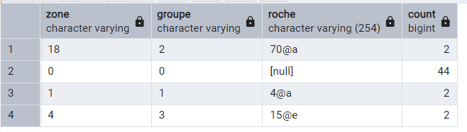
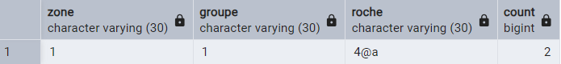
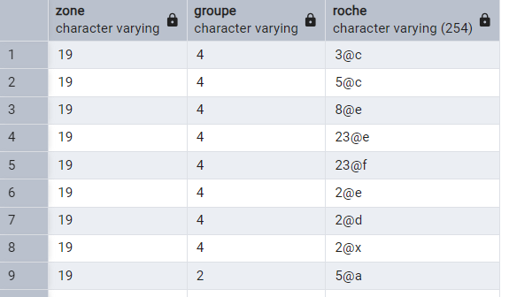
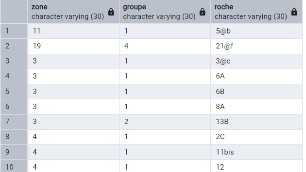

# données thèse -> serveur

## vérifications

**SHP**: données thèse
`roches`: DB Postgres

### roches

#### doublons

**SHP**

Après l'import du SHP dans Pg

```sql
SELECT
    zone,
    groupe,
    roche,
    COUNT(*)
FROM public.roches_shp
GROUP BY zone, groupe, roche
HAVING COUNT(*) > 1;
```

**(archives)**[^1]

_duplicates_


`roches`

```sql
SELECT
    zone,
    groupe,
    roche,
    COUNT(*)
FROM public.roches
GROUP BY zone, groupe, roche
HAVING COUNT(*) > 1;
```

**(archives)**[^1]

_duplicates_


#### matching

> La table `roches_shp` dans Pg est l'import du **SHP** de thèse avec les coordonnées en RGF93 (les + précises)

* Dans `roches` mais pas dans **SHP**

```sql
SELECT
    s.zone,
    s.groupe,
    s.roche
FROM public.roches_shp AS s
LEFT JOIN public.roches AS r
  ON r.zone   = s.zone
 AND r.groupe = s.groupe
 AND r.roche  = s.roche
WHERE r.roche IS NULL
ORDER BY s.zone, s.groupe, s.roche;
```

<br>
..._continue_

40 roches manquantes (dans `roches` mais pas dans **SHP**)

* Dans **SHP** mais pas dans `roches`

```sql
SELECT
    r.zone,
    r.groupe,
    r.roche,
	r.idroche -- utile pour éviter des erreurs sur le num de roche, ex: 2,10E+02
FROM public.roches AS r
LEFT JOIN public.roches_shp AS s
  ON r.zone   = s.zone
 AND r.groupe = s.groupe
 AND r.roche  = s.roche
WHERE s.roche IS NULL
ORDER BY r.zone, r.groupe, r.roche;
```

27 roches manquantes (_mismatch_)


(archives)

<br>
..._continue_

36 roches manquantes (dans **SHP** mais pas dans `roches`)

### faces

* faces sans roches

```sql
SELECT f.*
FROM faces f
LEFT JOIN roches r ON r.idroche = f.idroche
WHERE r.idroche IS NULL;
```

* figures sans faces

```sql
SELECT g.*
FROM figures g
LEFT JOIN faces f ON f.idface = g.idface
WHERE f.idface IS NULL;
```

[^1]: cf _Issues_