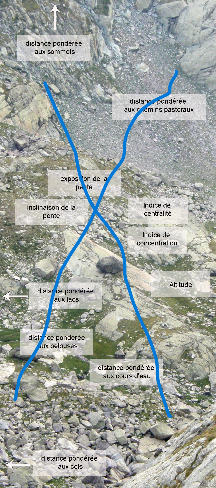
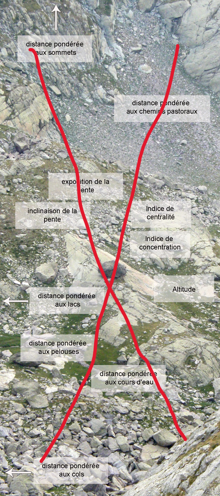
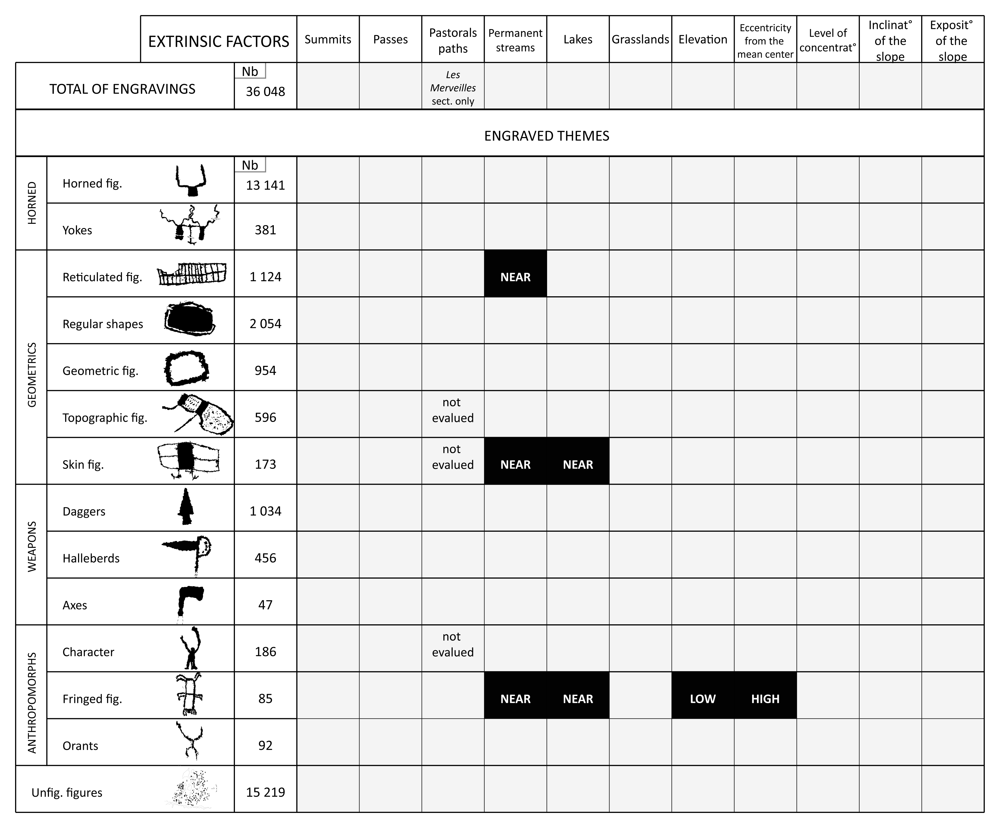

```{r, echo=FALSE}
library(dplyr)
library(kableExtra)
```

# Site presentation {background-image="https://raw.githubusercontent.com/iramat/iramat-dev/master/img/iiif-pres-collection-multi.png" background-opacity=0.2 background-size="400px" background-repeat="repeat"}

## Map

```{=html}
<div class="iframe-figure">
  <iframe width="1200" height="500"
          src="https://iramat-apps.cnrs.fr/project/bego/bego_roches_map.html"
          title="ZIGIR4B"></iframe>
</div>
```
<div class="captiontext">Rocks with pecked engravings <https://iramat-apps.cnrs.fr/project/bego/bego_roches_map.html></div>


# Figures à franges {background-image="https://raw.githubusercontent.com/iramat/iramat-dev/master/img/iiif-pres-collection-multi.png" background-opacity=0.2 background-size="400px" background-repeat="repeat"}


## Roche au grand réticulé complexe

::: {.panel-tabset}

### Engraved rock

{height=400}

### Engravings


```{=html}
<div class="iframe-figure">
  <iframe width="1200" height="400"
          src="https://iramat-apps.cnrs.fr/view/bego/prj/neoalps/ZIVGIR10@c.html"
          title="ZIGIR4B"></iframe>
</div>
```
<div class="captiontext"> <https://iramat-apps.cnrs.fr/view/bego/prj/neoalps/ZIVGIR10@c.html></div>

### Local view

<script src="https://cdnjs.cloudflare.com/ajax/libs/openseadragon/5.0.1/openseadragon.min.js"></script>

<div id="panorama-zivgir10"
     style="
       width:100%;
       height:500px;
       background:#fff;
       border-radius:4px;
       overflow:hidden;">
</div>

<script>
const viewerZIVGIR10 = OpenSeadragon({
    id: "panorama-zivgir10",

    prefixUrl:
      "https://cdnjs.cloudflare.com/ajax/libs/openseadragon/5.0.1/images/",

    tileSources: {
        type: "image",
        url: "https://iramat-apps.cnrs.fr/iiif/2/bego%2Froches%2FZIV%2FZIVGI%2FZIVGIR10%40c%2FZIVGIR10%40c_HL.jpg/full/full/0/default.jpg"
    },

    showNavigationControl: false,
    showNavigator: false,

    visibilityRatio: 1,
    constrainDuringPan: true,

    // Allow zooming beyond native pixel resolution
    maxZoomPixelRatio: 8,

    gestureSettingsMouse: {
        scrollToZoom: true,
        clickToZoom: false,
        dblClickToZoom: true
    }
});

viewerZIVGIR10.addHandler("open", function () {

    const homeZoom = viewerZIVGIR10.viewport.getHomeZoom();

    console.log("homeZoom =", homeZoom);
    console.log("targetZoom =", homeZoom * 2);

    // Explicitly set the centre first
    const center = viewerZIVGIR10.viewport.getHomeBounds().getCenter();

    viewerZIVGIR10.viewport.panTo(center, true);
    viewerZIVGIR10.viewport.zoomTo(homeZoom * 2, center, true);
});
</script>

:::


## <small>Roche des figures à franges et du double zigzag</small>

::: {.panel-tabset}


### Location


```{=html}
<div class="iframe-figure">
  <iframe width="1200" height="400"
          src="https://iramat-apps.cnrs.fr/project/bego/bego_roches_map_10.3.5@l.html"
          title="ZXGIIIR5@l"></iframe>
</div>
```

### Engraved rock

<div id="panorama-hl1"
     style="width:100%; height:500px; background:#fff;">
</div>

<script>
const viewerHL1 = OpenSeadragon({
    id: "panorama-hl1",

    prefixUrl:
      "https://cdnjs.cloudflare.com/ajax/libs/openseadragon/5.0.1/images/",

    tileSources:
      "https://iramat-apps.cnrs.fr/iiif/2/bego%2Froches%2FZX%2FZXGIII%2FZXGIIIR5%40l%2F5%40l.png/info.json",

    showNavigator: true,
    showFullPageControl: true,
    visibilityRatio: 1,
    constrainDuringPan: true
});


viewerHL1.addHandler("open", function() {

    // IIIF xywh coordinates
    const xywh = [
        2128.929931640625,
        1337.3331298828125,
        296.36376953125,
        296.3636474609375
    ];

    // Get the actual IIIF tiled image
    const tiledImage = viewerHL1.world.getItemAt(0);

    // Convert image pixel coordinates to OSD viewport coordinates
    const viewportRect =
        tiledImage.imageToViewportRectangle(
            xywh[0],
            xywh[1],
            xywh[2],
            xywh[3]
        );

    // Annotation rectangle
    const marker = document.createElement("div");

    marker.style.border = "2px solid red";
    marker.style.boxSizing = "border-box";
    marker.style.background = "rgba(255,0,0,0.05)";
    marker.style.cursor = "pointer";

    marker.title = "Engraved rock ZI.GI.R 10";

    viewerHL1.addOverlay({
        element: marker,
        location: viewportRect
    });
});
</script>


### Engravings


```{=html}
<div class="iframe-figure">
  <iframe width="1200" height="400"
          src="https://iramat-apps.cnrs.fr/view/bego/prj/neoalps/ZXGIIIR5@l.html"
          title="ZXGIIIR5@l"></iframe>
</div>
```
<div class="captiontext"> <https://iramat-apps.cnrs.fr/view/bego/prj/neoalps/ZXGIIIR5@l.html></div>

### Local view

<div id="panorama-hl2"
     style="
       width:100%;
       height:500px;
       background:#fff;
       border-radius:4px;
       overflow:hidden;">
</div>

<script>
const viewerHL2 = OpenSeadragon({
    id: "panorama-hl2",

    prefixUrl:
      "https://cdnjs.cloudflare.com/ajax/libs/openseadragon/5.0.1/images/",

    tileSources: {
        type: "image",
        url: "https://iramat-apps.cnrs.fr/iiif/2/bego%2Froches%2FZX%2FZXGIII%2FZXGIIIR5@l%2FZXGIIIR5@l_Hl-%20copie.png/full/full/0/default.jpg"
    },

    showNavigationControl: false,
    showNavigator: false,

    visibilityRatio: 1,
    constrainDuringPan: true,

    gestureSettingsMouse: {
        scrollToZoom: true,
        clickToZoom: false,
        dblClickToZoom: true
    }
});

viewerHL2.addHandler("open", function () {
    const homeZoom = viewerHL2.viewport.getHomeZoom();

    viewerHL2.viewport.zoomTo(
        homeZoom * 2,
        viewerHL2.viewport.getCenter(),
        true
    );
});
</script>

:::

## Roche du grand goulet herbeux

::: {.panel-tabset}

### Engraved rock

TODO

### Engravings

```{=html}
<div class="iframe-figure">
  <iframe width="1200" height="500"
          src="https://iramat-apps.cnrs.fr/view/bego/prj/neoalps/ZIIGIIIR7.html"
          title="ZIGIR4B"></iframe>
</div>
```
<div class="captiontext"> <https://iramat-apps.cnrs.fr/view/bego/prj/neoalps/ZIIGIIIR7.html></div>

### Local view

<div id="panorama-ziigiiir7"
     style="
       width:100%;
       height:500px;
       background:#fff;
       border-radius:4px;
       overflow:hidden;">
</div>

<script>
const viewerZIIGIIIR7 = OpenSeadragon({
    id: "panorama-ziigiiir7",

    prefixUrl:
      "https://cdnjs.cloudflare.com/ajax/libs/openseadragon/5.0.1/images/",

    tileSources: {
        type: "image",
        url: "https://iramat-apps.cnrs.fr/iiif/2/bego%2Froches%2FZII%2FZIIGIII%2FZIIGIIIR7%2Fdepuis%20ZIIGIIIR7.jpg/full/full/0/default.jpg"
    },

    showNavigationControl: false,
    showNavigator: false,

    visibilityRatio: 1,
    constrainDuringPan: true,

    gestureSettingsMouse: {
        scrollToZoom: true,
        clickToZoom: false,
        dblClickToZoom: true
    }
});

viewerZIIGIIIR7.addHandler("open", function () {
    const homeZoom = viewerZIIGIIIR7.viewport.getHomeZoom();

    viewerZIIGIIIR7.viewport.zoomTo(
        homeZoom * 2,
        viewerZIIGIIIR7.viewport.getCenter(),
        true
    );
});
</script>

:::

## Superimpositions and associations

::: {.panel-tabset}


### <small>Roche rouge</small>

```{=html}
<div class="iframe-figure">
  <iframe width="1200" height="400"
          src="https://iramat-apps.cnrs.fr/view/bego/prj/neoalps/ZIGIR4B.html"
          title="ZIGIR4B"></iframe>
</div>
```
<div class="captiontext"> <https://iramat-apps.cnrs.fr/view/bego/prj/neoalps/ZIGIR4B.html></div>

### <small>Roche visible au soleil rasant</small>

```{=html}
<div class="iframe-figure">
  <iframe width="1200" height="400"
          src="https://iramat-apps.cnrs.fr/view/bego/prj/neoalps/ZIIGIR9.html"
          title="ZIGIR4B"></iframe>
</div>
```
<div class="captiontext"> <https://iramat-apps.cnrs.fr/view/bego/prj/neoalps/ZIIGIR9.html></div>

### <small>Roche des six plages</small>

```{=html}
<div class="iframe-figure">
  <iframe width="1200" height="400"
          src="https://iramat-apps.cnrs.fr/view/bego/prj/neoalps/ZIGIR5.html"
          title="ZIGIR4B"></iframe>
</div>
```
<div class="captiontext"> <https://iramat-apps.cnrs.fr/view/bego/prj/neoalps/ZIGIR5.html></div>

:::


# Annexes

## Superimpositions

https://iramat-apps.cnrs.fr/view/bego/varia/superpositions_v.html

## {auto-animate=true}


::: {style="margin-top: 100px;"}
Animating content
{height=500}
:::

## {auto-animate=true}


::: {style="margin-top: 100px;"}
Animating content
{height=500}
{height=500}
:::

## {auto-animate=true}

::: {style="margin-top: 100px;"}
Animating content
{height=500}
{height=500}
:::

## {auto-animate=true}

::: {style="margin-top: 100px;"}
Animating content
{height=500}
{height=500}
:::